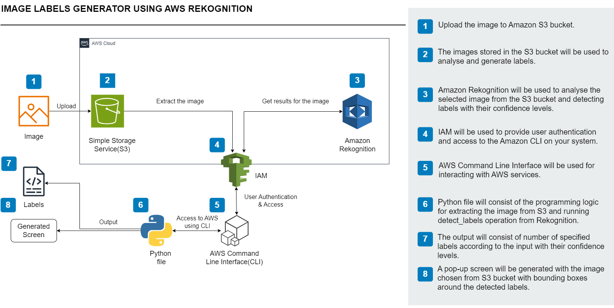
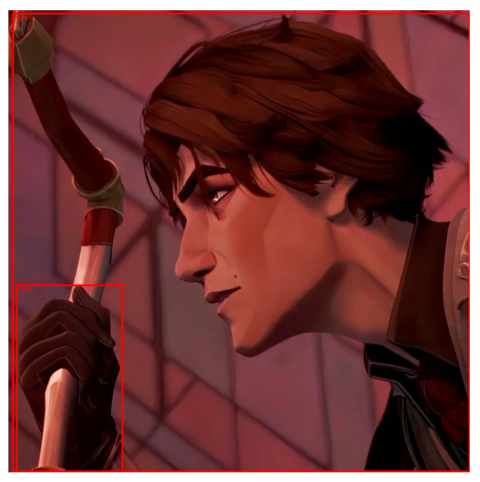
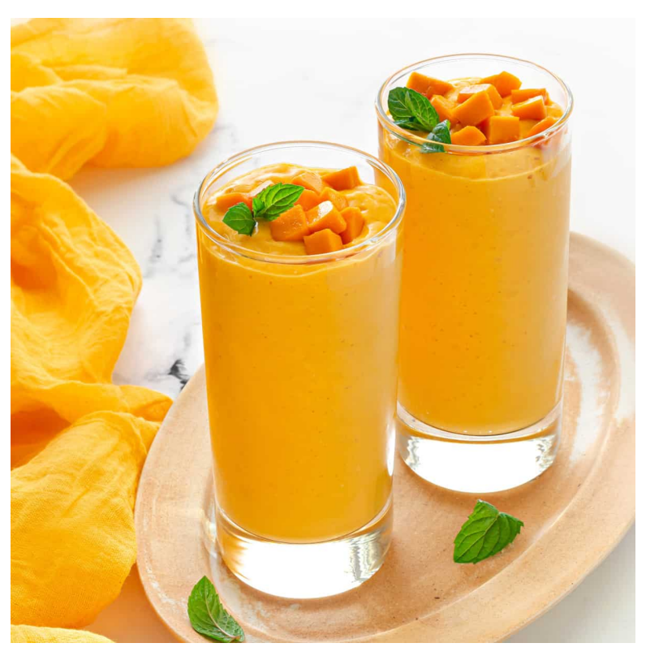
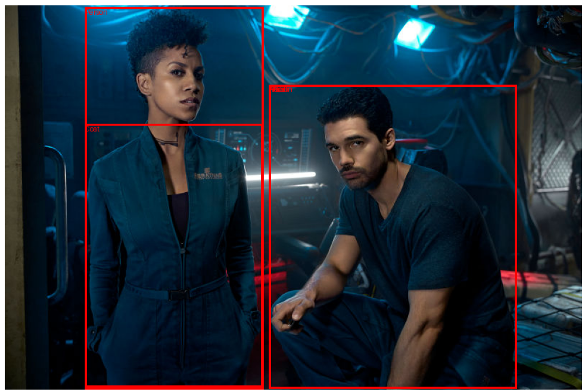
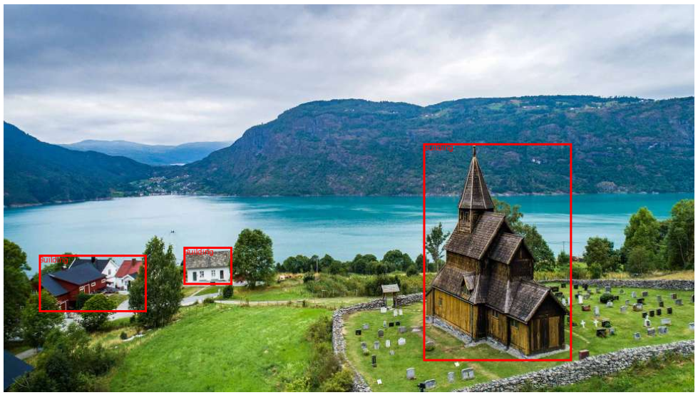
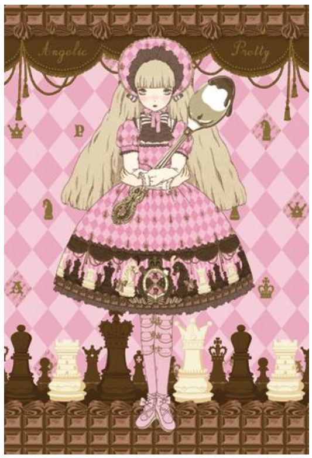
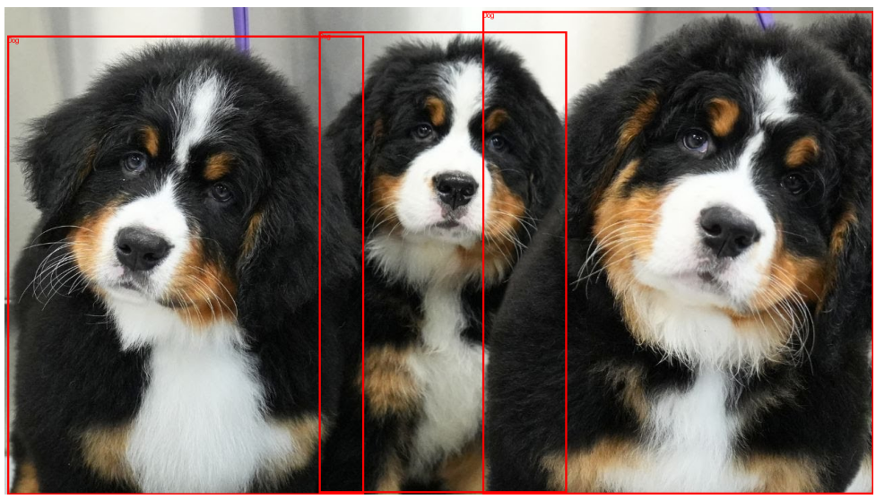

# Rekognition Label Generator
## **Project Overview**



In this project I used Amazon Rekognition, an AWS service for image and video analysis, to analyze images and generates descriptive labels with an S3 bucket to store images, AWS CLI for setup and script running, as well as Python to call Rekognition’s `detect_labels` API. 

### **Create S3 Bucket and Upload Images**

First I went to [Amazon S3](https://aws.amazon.com/s3/) and clicked "Create bucket" before naming it `kaj-image-labels-generator` and choosing `us-east-1` for the region. I kept the bucket private and then uploaded 6 images with “Upload”. For variety, I chose 6 images to test Rekognition:

1. Viktor from Arcane, my favorite animated TV show.
2. Mango smoothie (or lassi), my favorite drink.
3. A picture from The Expanse, my favorite sci-fi media.
4. A landscape from the Netherlands, enough said.
5. Anime art of a girl with a retro chocolate theme.
6. Three Bernese mountain dog puppies.

---

### **IAM Role, AWS CLI Configuration, and Library Installation**

I created an IAM role with the following 2 policies enabled `AmazonRekognitionFullAccess` and `AmazonS3FullAccess` before attaching it to my user. Then, I installed the AWS CLI from the site: [official site](https://aws.amazon.com/cli/) and used version 2.22.23 for this project. Opening the terminal, I ran the bash command:

```bash
aws configure
```

I then provided my Access Key ID, Secret Access Key, default region (`us-east-1`) and default output format (`json`). I also installed boto3, the AWS SDK for Python, as well as pillow and matplotlib:

```bash
pip install boto3 pillow matplotlib
```

---

### **Code**

Then, I saved the `label_generator_script.py` script in the same directory as the images. This script fetches images from the S3 bucket, analyzes them using Rekognition, and print the results along with presenting the images with Matplotlib red bounding boxes around detected objects!

### Results and Conclusion

These were the results before I deleted the S3 bucket and its contents to avoid ongoing charges along with removing unused IAM credentials and policies. 

Labels for 1.jpg → Viktor from the animated TV show Arcane:



```powershell
- Person (Confidence: 99.41%)
- Face (Confidence: 94.18%)
- Head (Confidence: 94.18%)
- Clothing (Confidence: 88.76%)
- Glove (Confidence: 88.76%)
- Anime (Confidence: 86.04%)
```

Labels for 2.jpg → Mango smoothie (or lassi) :



```powershell
- Beverage (Confidence: 99.52%)
- Juice (Confidence: 99.52%)
- Cream (Confidence: 91.20%)
- Dessert (Confidence: 91.20%)
- Food (Confidence: 91.20%)
- Mousse (Confidence: 91.20%)
- Smoothie (Confidence: 89.87%)
- Food Presentation (Confidence: 88.46%)
```

Labels for 3.jpg → A picture from The Expanse:



```powershell
- Adult (Confidence: 97.12%)
- Male (Confidence: 97.12%)
- Man (Confidence: 97.12%)
- Person (Confidence: 97.12%)
```

Labels for 4.jpg → A landscape from the Netherlands:



```powershell
- Nature (Confidence: 100.00%)
- Outdoors (Confidence: 100.00%)
- Scenery (Confidence: 100.00%)
- Building (Confidence: 99.59%)
- Landscape (Confidence: 99.43%)
- Lake (Confidence: 96.69%)
- Water (Confidence: 96.69%)
- Countryside (Confidence: 92.92%)
- Sea (Confidence: 85.10%)
- Rural (Confidence: 80.28%)
```

Labels for 5.jpg → Anime art of a girl:



```powershell
- Purple (Confidence: 99.95%)
- Book (Confidence: 81.06%)
- Comics (Confidence: 81.06%)
- Publication (Confidence: 81.06%)
- Pattern (Confidence: 76.62%)
```

Labels for 6.jpg → Three Bernese mountain dog puppies:



```powershell
- Animal (Confidence: 98.45%)
- Canine (Confidence: 98.45%)
- Dog (Confidence: 98.45%)
- Mammal (Confidence: 98.45%)
- Pet (Confidence: 98.45%)
- Puppy (Confidence: 97.83%)
- Appenzeller (Confidence: 84.46%)
```
